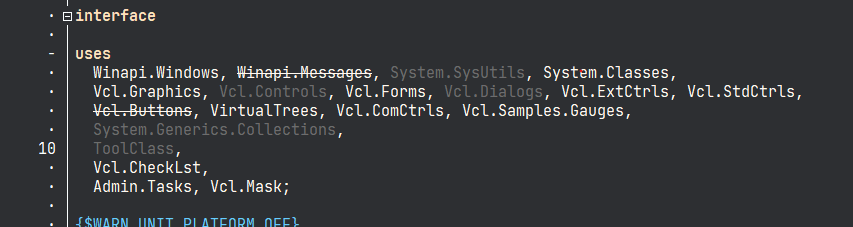

# CodeEditorPaintTextPAL
A conceptual Delphi IDE plugin - to visualize the uses section, based on the uses.txt report from Peganza's Pascal Analyser (Lite).

### Instructions
Install Peganza Pascal Analyzer Lite, setup a project for a Delphi project and analyzer.

Open the plugin .dpk file in Delphi 11.3 or later, build and install. Now open the Delphi project you analysed earlier - and the uses sections should now be painted more helpfull in the IDE. 

### Disclaimer
This code is by no means done and perfected - please tinker and improve to everyones benefit.